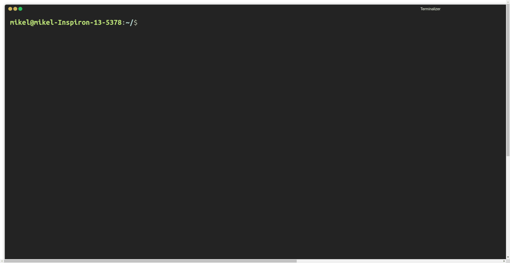

# yeoman-hyperledger

A Docker image for creating the skeleton of Hyperledger's business networks.

## Usage

```
docker pull memaldi/yeoman-hyperledger
docker run -ti --rm memaldi/yeoman-hyperledger <yo-command>
```

Example:



